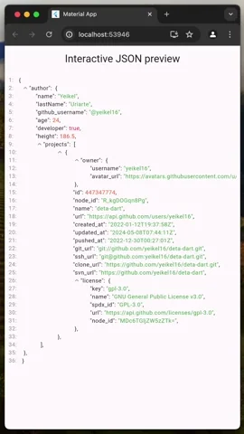

# Interactive Json Preview

[![style: very good analysis][very_good_analysis_badge]][very_good_analysis_link]
[](https://github.com/felangel/mason)
[![License: MIT][license_badge]][license_link]

A pretty interactive JSON viewer to improve readability. Collapses and expands sections in which JSON objects are complex at a glance.



## Installation 💻

Install via `flutter pub add`:

```sh
dart pub add interactive_json_preview
```

## Import

```dart
import 'package:interactive_json_preview/interactive_json_preview.dart';
```

## Example

```dart
import 'package:flutter/material.dart';
import 'package:interactive_json_preview/interactive_json_preview.dart';

void main() => runApp(const MyApp());

class MyApp extends StatelessWidget {
  const MyApp({super.key});

  @override
  Widget build(BuildContext context) {
    return MaterialApp(
      title: 'Material App',
      home: Scaffold(
        appBar: AppBar(
          title: const Text('Interactive JSON preview'),
        ),
        body: InteractiveJsonPreview(data: data),
      ),
    );
  }
}

final data = {
  "author": {
    "name": "Yeikel",
    "lastName": "Uriarte",
    "github_username": "@yeikel16",
    "age": 24,
    "developer": true,
    "height": 186.5,
    "projects": [
      {
        "owner": {
          "username": "yeikel16",
          "avatar_url": "https://avatars.githubusercontent.com/u/26438532?v=4",
        },
        "id": 447347774,
        "node_id": "R_kgDOGqn8Pg",
        "name": "deta-dart",
        "url": "https://api.github.com/users/yeikel16",
        "created_at": "2022-01-12T19:37:58Z",
        "updated_at": "2024-05-08T07:44:11Z",
        "pushed_at": "2022-12-30T00:27:01Z",
        "git_url": "git://github.com/yeikel16/deta-dart.git",
        "ssh_url": "git@github.com:yeikel16/deta-dart.git",
        "clone_url": "https://github.com/yeikel16/deta-dart.git",
        "svn_url": "https://github.com/yeikel16/deta-dart",
        "license": {
          "key": "gpl-3.0",
          "name": "GNU General Public License v3.0",
          "spdx_id": "GPL-3.0",
          "url": "https://api.github.com/licenses/gpl-3.0",
          "node_id": "MDc6TGljZW5zZTk="
        }
      }
    ]
  },
};
```


## Sponsored by

<a href="https://educup.io">
    
</a>


## Bugs or Requests

If you want to [report a problem][github_issue_link] or would like to add a new feature, feel free to open an [issue on GitHub][github_issue_link]. Pull requests are also welcome.

[github_issue_link]: https://github.com/yeikel16/interactive_json_preview/issues
[license_badge]: https://img.shields.io/badge/license-MIT-blue.svg
[license_link]: https://opensource.org/licenses/MIT
[very_good_analysis_badge]: https://img.shields.io/badge/style-very_good_analysis-B22C89.svg
[very_good_analysis_link]: https://pub.dev/packages/very_good_analysis
